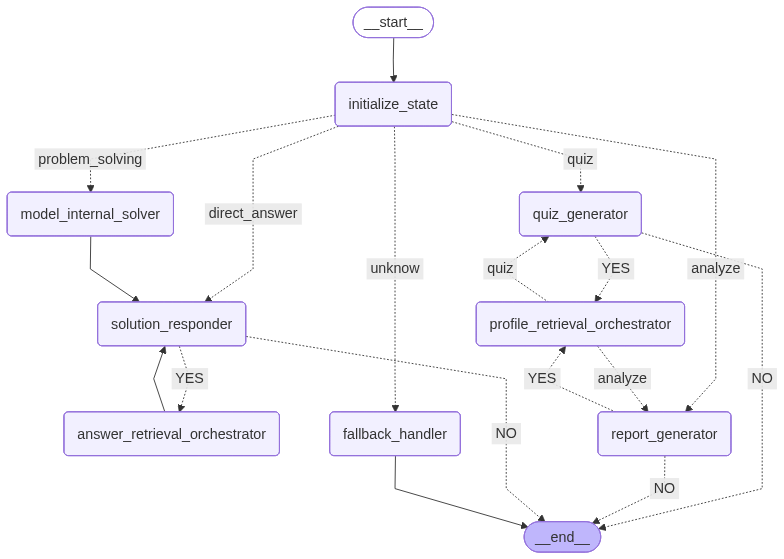

# Exam Practice Agent



Exam Practice Agent is a LangGraph-powered assistant prototype built for an exam practice portal. It highlights how structured state, modular nodes, and retrieval-augmented workflows can be combined to deliver problem solving, contextual lookup, and learner insights in one pipeline.

If you are curious how an AI coach could classify tasks, loop through retrieval only when needed, generate quizzes, and compile personalized reports, the sections below walk through the state contract, node responsibilities, and validation ideas.

---

## System Overview

```
.
├── struct_generator.py
├── langgraph_structure.png
└── exam_practice_agent
    ├── __init__.py
    ├── graph.py
    ├── routing.py
    ├── state.py
    ├── llm.py
    ├── prompts/
    └── nodes/
```

- `graph.py` wires LangGraph nodes and edges.
- `routing.py` converts model decisions into graph routes.
- `state.py` defines shared state fields to keep node contracts explicit.
- `nodes/` contains the concrete implementations for initialization, solving, retrieval, quiz, and reporting logic.
- `struct_generator.py` renders the LangGraph structure diagram for quick visualization.
- `prompts/` stores router and internal knowledge prompts so they can be tuned separately.

---

## State Model

`state.py` exports `ConversationState`, the shared TypedDict passed between nodes. The `initialize_state` node prepares this state, ensuring each downstream node reads from and writes to explicit fields.

| Field | Description |
| --- | --- |
| `history` | Conversation history that LangGraph aggregates for context. |
| `user_message` | Raw user input for the current turn. |
| `current_question` | Identifier or title of the question being solved. |
| `problem_solver_model` | Label of the model used for problem solving. |
| `model_think` | Internal reasoning or provisional answer from the model. |
| `model_think_confidence` | Confidence score for `model_think` (0-10). |
| `retrieved_context` | Aggregated retrieval snippets leveraged by downstream nodes. |
| `current_route` | Next route chosen by the router model. |

---

## Core Workflow

1. **Initialization & Routing**  
   `initialize_state` normalizes inputs, while `routing.task_router` predicts the next route based on the `ROUTER_PROMPT`.

2. **Problem Solving Loop**  
   `model_internal_solver` reasons with internal knowledge and returns confidence plus suggested queries. Low confidence triggers `answer_retrieval_orchestrator` to enrich context.

3. **Direct Answer Response**  
   When routing selects `direct_answer`, `solution_responder` produces a response immediately, skipping retrieval loops to minimize latency.

4. **Analyze & Quiz Requests**  
   When users ask for analytics or practice, the graph pulls user data through `profile_retrieval_orchestrator`, prepares quiz tasks via `quiz_generator`, and compiles reports with `report_generator`.

5. **Unknown Safeguard**  
   Messages outside the exam scope route to `fallback_handler`, ensuring safe, templated replies that avoid prompt injection.

---

## Node Responsibilities

| Node | File | Summary |
| --- | --- | --- |
| `initialize_state` | `nodes/initialize_state_node.py` | Resets transient fields and triggers routing. |
| `model_internal_solver` | `nodes/model_internal_solver_node.py` | Produces internal reasoning, confidence, and suggested queries. |
| `solution_responder` | `nodes/solution_responder_node.py` | Assembles an answer and decides whether to continue the loop. |
| `answer_retrieval_orchestrator` | `nodes/answer_retrieval_orchestrator_node.py` | Manages retrieval when confidence is low. |
| `profile_retrieval_orchestrator` | `nodes/profile_retrieval_orchestrator_node.py` | Fetches user performance context to support analytics and quizzes. |
| `quiz_generator` | `nodes/quiz_generator_node.py` | Creates personalized practice tasks. |
| `report_generator` | `nodes/report_generator_node.py` | Aggregates quiz and analysis insights into reports. |
| `fallback_handler` | `nodes/fallback_handler_node.py` | Responds to unsupported intents with safe templates. |

---

## Future Validation Ideas

- Unit-test routing and node logic to guarantee state transitions and updates behave as expected.
- Use the LangGraph runtime to simulate end-to-end scenarios (direct answer, retrieval loop, quiz generation, analysis reporting).
- Rank retrieval snippets by similarity to the question to prevent context overload and focus on the most relevant evidence.
- Build an offline evaluation set for the RAG loop, tracking metrics such as recall, accuracy, and failure modes to guide retriever or prompt tuning.
- Run prompt-injection and privilege-escalation tests to verify `initialize_state` and `fallback_handler` guard critical state.
- Interview-ready enhancements: automated RAG evaluation reports, latency/cost dashboards per node, and A/B scripts for personalized feedback strategies.

---

## License

Distributed under the [MIT License](LICENSE).
